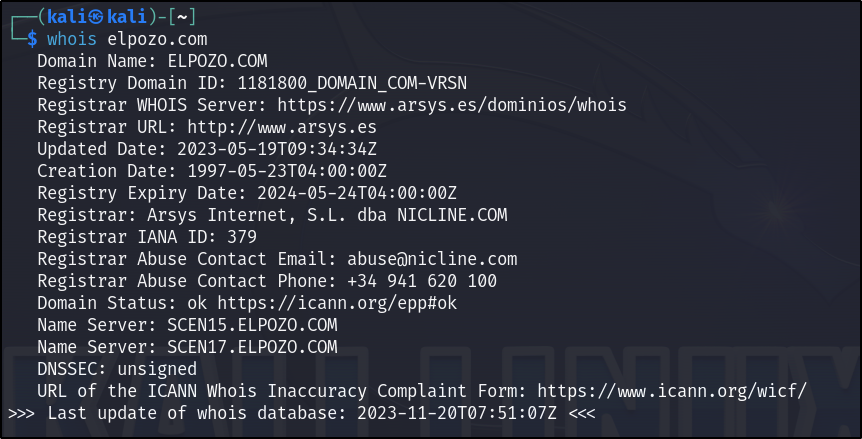
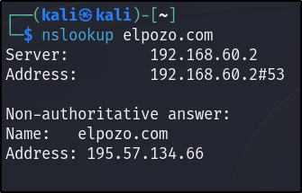
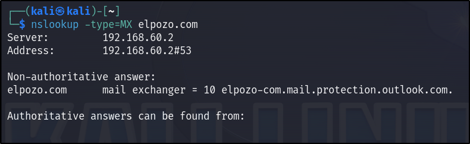
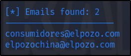
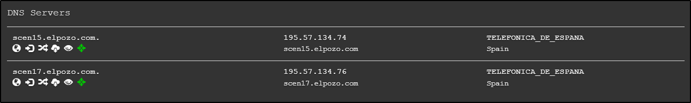
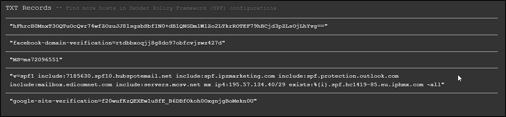
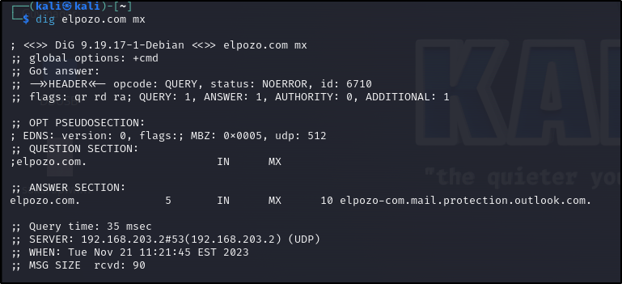
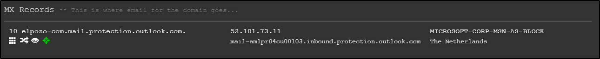

# Contenido 
1. [Introducción](#id1)
2. [Información Whois](#id2)
3. [Servidores DNS](#id3)
4. [Servidores de Correo](#id4)
5. [Subdominios](#id5)
6. [Información Adicional](#id6)

## 1. Introducción 

Se nos ha pedido recopilar toda la información sobre la infraestructura
de la empresa "El POZO" disponible en fuentes abierta.

Esta investigación la he realizado en una máquina virtual, más
concretamente en una máquina Kali Linux, que viene con diversas
herramientas para este tipo de búsquedas.

## 2. Información Whois. 

En este apartado vamos a sacar información sobre la empresa, así como
sus datos de contacto correo, etc. Para ello he hecho uso del comando
"whois", simplemente vamos a la terminal, lo colocamos seguido del
dominio y nos da el siguiente resultado:

Aquí podemos comprobar datos como:

Todo lo relacionado al dominio web (última fecha de creación y
actualización del dominio, fecha de expiración, etc), podemos comprobar
que el dominio lo tienen registrado por un tercero, en este caso arsys,
una web utilizada para este fin.

También podemos ver el email y el teléfono de contacto para denunciar en
caso de que creamos que se usa inadecuadamente el nombre del dominio.

Continuando con nuestra investigación, hacemos uso de otro comando que
tenemos para saber la dirección ip del dominio, para ello en la terminal
colocamos "nslookup" seguido del dominio en cuestión.

Podemos ver la dirección ip del servidor, y su puerto, en este caso el
53 ya que es un servicio tcp/ip.

Haciendo uso de la herramienta "TheHarverster", que también viene
preinstalada en nuestro sistema Kali Linux, hemos sacado diversa
información, que iremos colocando en sus respectivos apartados, para
este, hemos sacado dos direcciones de emails, en este caso para
consumidores.

## 3. Servidores DNS 

Para esta sección he hecho uso de la herramienta web "dnsdumpster", la
cual nos ha proporcionado mucha información de la empresa. Así como sus
servidores DNS y sus registros txt de DNS.

## 4. Servidores de Correo 

Para conocer el servidor de correo, hemos hecho uso del comando "dig" en
nuestra máquina Linux, simplemente lo colocamos en el terminal seguido
del dominio y las letras "mx", tal como muestro a continuación:

La página anterior también nos proporcionó el servidor de correo que usa
la empresa.

## 5. Subdominios 

La web utilizada anteriormente nos ha proporcionado un mapa del dominio
que tiene elpozo.com, que podemos ver en el siguiente enlace:

[Mapa de dominios](https://dnsdumpster.com/static/map/elpozo.com.png)

## Información Adicional  

Respecto a las RRSS podemos ver en su página web enlaces a las distintas
redes que tiene la empresa:

- [Facebook](https://www.facebook.com/ElPozoAlimentacion/timeline/)
- [Instagram](https://www.instagram.com/elpozoalimentacion/)
- [Twitter](https://twitter.com/ElPozoAlimenta)
- [Youtube] (https://www.youtube.com/c/ElPozoAlimentaciónvideos)

Tambien podemos encontrar el [LinkeIn](https://www.linkedin.com/company/elpozo-alimentacion-s.a./) de la empresa, el cual nos aportará muchísima información sobre los
trabajadores de la misma, la cual nos permitiría intentar ataques de
ingeniería social
